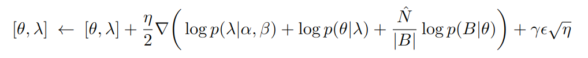

# BayesTune: Bayesian Sparse Deep Model Fine-tuning (NeurIPS 2023) -- A Bayesian Approach to PEFT

Deep learning practice is increasingly driven by powerful foundation models (FM), pre-trained at scale and then fine-tuned for specific tasks of interest. A key property of this workflow is the efficacy of performing sparse or parameter-efficient fine-tuning, meaning that by updating only a tiny fraction of the whole FM parameters on a downstream task can lead to surprisingly good performance, often even superior to a full model update. However, it is not clear what is the optimal and principled way to select which parameters to update. Although a growing number of sparse fine-tuning ideas have been proposed, they are mostly not satisfactory, relying on hand-crafted heuristics or heavy approximation. In this paper we propose a novel Bayesian sparse fine-tuning algorithm: we place a (sparse) Laplace prior for each parameter of the FM, with the mean equal to the initial value and the scale parameter having a hyper-prior that encourages small scale. Roughly speaking, the posterior means of the scale parameters indicate how important it is to update the corresponding parameter away from its initial value when solving the downstream task. Given the sparse prior, most scale parameters are small a posteriori, and the few large-valued scale parameters identify those FM parameters that crucially need to be updated away from their initial values. Based on this, we can threshold the scale parameters to decide which parameters to update or freeze, leading to a principled sparse fine-tuning strategy. To efficiently infer the posterior distribution of the scale parameters, we adopt the Langevin MCMC sampler, requiring only two times the complexity of the vanilla SGD. Tested on popular NLP benchmarks as well as the VTAB vision tasks, our approach shows significant improvement over the state-of-the-arts (e.g., 1% point higher than the best SOTA when fine-tuning RoBERTa for GLUE and SuperGLUE benchmarks).  For the details, please see [1].

<p align="center">
  
</p>

---

## Set up environment
```
Python >= 3.7.8
PyTorch >= 1.8.1+cu102
TorchVision >= 0.9.1+cu102

>> pip install jiant packaging==21.3 transformers
```

## Datasets

Download the "data/tasks" from SAM [10]: [https://github.com/fuzihaofzh/AnalyzeParameterEfficientFinetune](https://github.com/fuzihaofzh/AnalyzeParameterEfficientFinetune)


## Command lines for training with ```mrpc```

(stage-1)
```
>> python3 demo_stage1.py run --data_dir [DATA-DIR] --exp_dir output/exps/mrpc --hf_pretrained_model_name_or_path roberta-base --tasks mrpc --train_batch_size 16 --num_train_epochs 10000 --min_train_steps 20000 --eval_every_steps 500 --keep_checkpoint_when_done --do_test --log_dir output/logs/runs/test/ --learning_rate 1e-4 --no_improvements_for_n_evals 40 --user_mode alp=0.01,bet=100,lamb_init=0.0001,lr_others=0.01,Nexp=12,nd=1,burnin_steps=12000,thin_steps=100,warmup_steps=10000 --seed 0 --run_name trial1_stage1_seed0 
```

(stage-2)
```
>> python3 demo_stage2.py run --data_dir [DATA-DIR] --exp_dir output/exps/mrpc --hf_pretrained_model_name_or_path roberta-base --tasks mrpc --train_batch_size 16 --num_train_epochs 10000 --min_train_steps 20000 --eval_every_steps 500 --keep_checkpoint_when_done --do_test --log_dir output/logs/runs/test/ --learning_rate 1e-3 --no_improvements_for_n_evals 40 --user_mode splevel=0.005,mcmc=0,lamb_path=output/exps/mrpc/runs/trial1_stage1_seed0/lambda_stats.pt --seed 0 --run_name trial1_stage2_mcmc0_seed0 
```

The detailed hyperparameters for the other datasets can be found in Appendix in our paper.


## Acknowledgements
This code is built from [the jiant library](https://jiant.info/) and [https://github.com/fuzihaofzh/AnalyzeParameterEfficientFinetune](https://github.com/fuzihaofzh/AnalyzeParameterEfficientFinetune).


## References
[1] Kim, Minyoung and Hospedales, Timothy, "BayesTune: Bayesian Sparse Deep Model Fine-tuning", *Advances in Neural Information Processing Systems.* 2023.


## Citation
If you found this library useful in your research, please cite:
```
@article{kim_hospedales_neurips2023,
  title={{BayesTune: Bayesian Sparse Deep Model Fine-tuning}},
  author={Kim, Minyoung and Hospedales, Timothy},
  journal={Advances in Neural Information Processing Systems},
  year={2023}
}
```

